# 利用 SD WebUI 在电商场景下通过生成AI模特搭配服装的方案探索

## 概述

本实验使用了 img2img的 Inpaint upload支持服装图片和蒙版、LoRA提供模型人物风格、ControlNet控制人体姿态，同时使用 3D Openpose 插件生成人体姿态图。

## 1、图片处理

### a、原服装图片

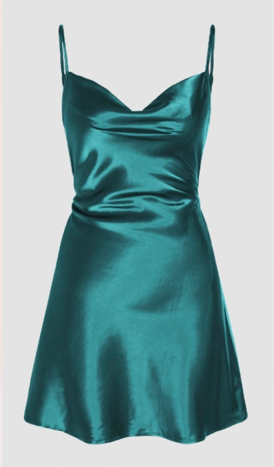

### b、使用图片处理工具处理分别得到一张纯色背景图片和服装部分涂黑的蒙版图片，需要保证两张图片内服装的位置一致，且图片尺寸需要指定 宽 * 高 = 600 * 1000。

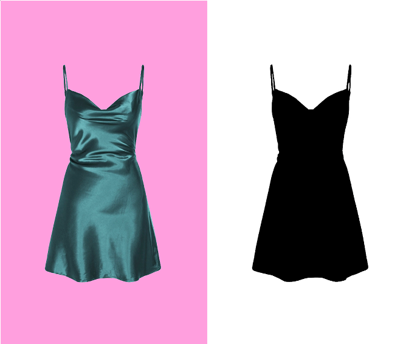

## 2、模特姿态线条图处理

使用 WebUI的 3D Openpose 扩展插件，导入处理好的图片作为背景。

### a、导入图片作为背景图，设置宽度和高度分别为600和1000

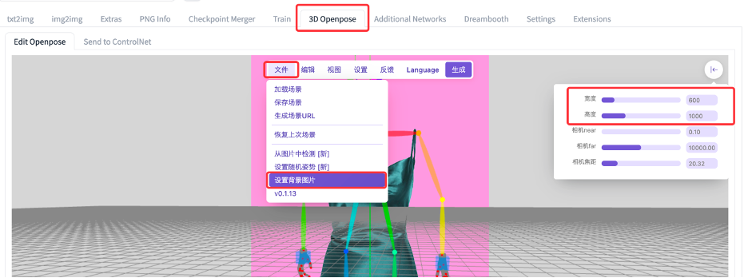

### b、调整姿态结构对应服装相对合适穿着位置

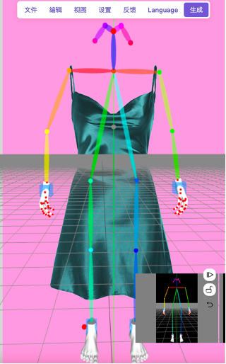

### c、点击生成，选取第一种姿态图片下载到本地备用

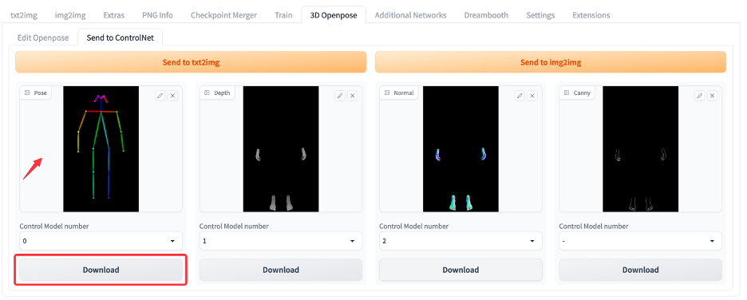

以上步骤完成了三张图片素材的准备工作，得到以下纯色背景服装图、蒙版图、姿态图

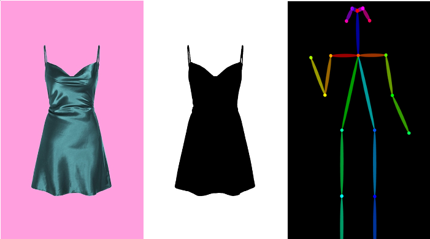

## 3、修改ControlNet的系统设置，提供3个控制选项Tab页，应用设置（注意：会重启WebUI，改变WebUI访问临时域名）

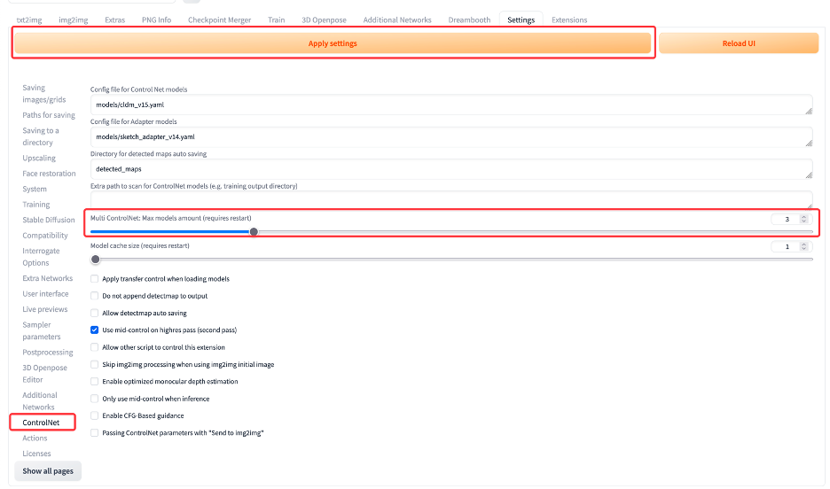

## 4、选择chilloutmax模型（基于sd 1.5 fine-tunning），填写样例prompt词。

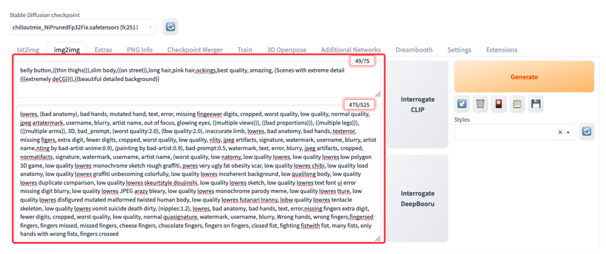

### 参考的正向词（示例）：

belly button,((thin thighs))),slim body,((on street)),long hair,pink hair,ockings,best quality, amazing, {Scenes with extreme detail {{{extremely deCG}}}),{{beautiful detailed background}}

###参考的负向词（示例）：

lowres, (bad anatomy), bad hands, mutated hand, text, error, missing fingeewer digits, cropped, worst quality, low quality, normal quality, jpeg artatermark, username, blurry, artist name, out of focus, glowing eyes, ((multiple views))), ((bad proportions))), ((multiple legs))), (((multiple arms)), 3D, bad_prompt, (worst quality:2.0), (lbw quality:2.0), inaccurate limb, lowres, bad anatomy, bad hands, texterror, missing figers, extra digit, fewer digits, cropped, worst quality, low quality, nlity, jpeg artifacts, signature, watermark, username, blurry, artist name,nting by bad-artist-anime:0.9), (painting by bad-artist:0.9), bad-prompt:0.5, watermark, text, error, blurry, jpeg artifacts, cropped, normatifacts, signature, watermark, username, artist name, (worst quality, low natomy, low quality lowres, low quality lowres low polygon 3D game, low quality lowres monochrome sketch rough graffiti, pwres very ugly fat obesity scar, low quality lowres chibi, low quality load anatomy, low quality lowres graffiti unbecoming colorfully, low quality lowres incoherent background, low qualilong body, low quality lowres duplicate comparison, low quality lowres skeurtstyle doujinshi, low quality lowres sketch, low quality lowres text font ui error missing digit blurry, low quality lowres JPEG arazy bleary, low quality lowres monochrome parody meme, low quality lowres tture, low quality lowres disfigured mutated malformed twisted human body, low quality lowres futanari tranny, lobw quality lowres tentacle skeleton, low quality lowres vomit suicide death dirty, (nipples:1.2), lowres, bad anatomy, bad hands, text, error,nissing fingers extra digit, fewer digits, cropped, worst quality, low quality, normal quasignature, watermark, username, blurry, Wrong hands, wrong fingers,fingersed fingers, fingers missed, missed fingers, cheese fingers, chocolate fingers, fingers on fingers, closed fist, fighting fistwith fist, many fists, only hands with wrong fists, fingers crossed, lowres, (bad anatomy), bad hands, mutated hand, text, error, missing fingeewer digits, cropped, worst quality, low quality, normal quality, jpeg artatermark, username, blurry, artist name, out of focus, glowing eyes, ((multiple views))), ((bad proportions))), ((multiple legs))), (((multiple arms)), 3D, bad_prompt, (worst quality:2.0), (lbw quality:2.0), inaccurate limb, lowres, bad anatomy, bad hands, texterror, missing figers, extra digit, fewer digits, cropped, worst quality, low quality, nlity, jpeg artifacts, signature, watermark, username, blurry, artist name,nting by bad-artist-anime:0.9), (painting by bad-artist:0.9), bad-prompt:0.5, watermark, text, error, blurry, jpeg artifacts, cropped, normatifacts, signature, watermark, username, artist name, (worst quality, low natomy, low quality lowres, low quality lowres low polygon 3D game, low quality lowres monochrome sketch rough graffiti, pwres very ugly fat obesity scar, low quality lowres chibi, low quality load anatomy, low quality lowres graffiti unbecoming colorfully, low quality lowres incoherent background, low qualilong body, low quality lowres duplicate comparison, low quality lowres skeurtstyle doujinshi, low quality lowres sketch, low quality lowres text font ui error missing digit blurry, low quality lowres JPEG arazy bleary, low quality lowres monochrome parody meme, low quality lowres tture, low quality lowres disfigured mutated malformed twisted human body, low quality lowres futanari tranny, lobw quality lowres tentacle skeleton, low quality lowres vomit suicide death dirty, (nipples:1.2), lowres, bad anatomy, bad hands, text, error,nissing fingers extra digit, fewer digits, cropped, worst quality, low quality, normal quasignature, watermark, username, blurry, Wrong hands, wrong fingers,fingersed fingers, fingers missed, missed fingers, cheese fingers, chocolate fingers, fingers on fingers, closed fist, fighting fistwith fist, many fists, only hands with wrong fists, fingers crossed, lowres, (bad anatomy), bad hands, mutated hand, text, error, missing fingeewer digits, cropped, worst quality, low quality, normal quality, jpeg artatermark, username, blurry, artist name, out of focus, glowing eyes, ((multiple views))), ((bad proportions))), ((multiple legs))), (((multiple arms)), 3D, bad_prompt, (worst quality:2.0), (lbw quality:2.0), inaccurate limb, lowres, bad anatomy, bad hands, texterror, missing figers, extra digit, fewer digits, cropped, worst quality, low quality, nlity, jpeg artifacts, signature, watermark, username, blurry, artist name,nting by bad-artist-anime:0.9), (painting by bad-artist:0.9), bad-prompt:0.5, watermark, text, error, blurry, jpeg artifacts, cropped, normatifacts, signature, watermark, username, artist name, (worst quality, low natomy, low quality lowres, low quality lowres low polygon 3D game, low quality lowres monochrome sketch rough graffiti, pwres very ugly fat obesity scar, low quality lowres chibi, low quality load anatomy, low quality lowres graffiti unbecoming colorfully, low quality lowres incoherent background, low qualilong body, low quality lowres duplicate comparison, low quality lowres skeurtstyle doujinshi, low quality lowres sketch, low quality lowres text font ui error missing digit blurry, low quality lowres JPEG arazy bleary, low quality lowres monochrome parody meme, low quality lowres tture, low quality lowres disfigured mutated malformed twisted human body, low quality lowres futanari tranny, lobw quality lowres tentacle skeleton, low quality lowres vomit suicide death dirty, (nipples:1.2), lowres, bad anatomy, bad hands, text, error,nissing fingers extra digit, fewer digits, cropped, worst quality, low quality, normal quasignature, watermark, username, blurry, Wrong hands, wrong fingers,fingersed fingers, fingers missed, missed fingers, cheese fingers, chocolate fingers, fingers on fingers, closed fist, fighting fistwith fist, many fists, only hands with wrong fists, fingers crossed, lowres, (bad anatomy), bad hands, mutated hand, text, error, missing fingeewer digits, cropped, worst quality, low quality, normal quality, jpeg artatermark, username, blurry, artist name, out of focus, glowing eyes, ((multiple views))), ((bad proportions))), ((multiple legs))), (((multiple arms)), 3D, bad_prompt, (worst quality:2.0), (lbw quality:2.0), inaccurate limb, lowres, bad anatomy, bad hands, texterror, missing figers, extra digit, fewer digits, cropped, worst quality, low quality, nlity, jpeg artifacts, signature, watermark, username, blurry, artist name,nting by bad-artist-anime:0.9), (painting by bad-artist:0.9), bad-prompt:0.5, watermark, text, error, blurry, jpeg artifacts, cropped, normatifacts, signature, watermark, username, artist name, (worst quality, low natomy, low quality lowres, low quality lowres low polygon 3D game, low quality lowres monochrome sketch rough graffiti, pwres very ugly fat obesity scar, low quality lowres chibi, low quality load anatomy, low quality lowres graffiti unbecoming colorfully, low quality lowres incoherent background, low qualilong body, low quality lowres duplicate comparison, low quality lowres skeurtstyle doujinshi, low quality lowres sketch, low quality lowres text font ui error missing digit blurry, low quality lowres JPEG arazy bleary, low quality lowres monochrome parody meme, low quality lowres tture, low quality lowres disfigured mutated malformed twisted human body, low quality lowres futanari tranny, lobw quality lowres tentacle skeleton, low quality lowres vomit suicide death dirty, (nipples:1.2), lowres, bad anatomy, bad hands, text, error,nissing fingers extra digit, fewer digits, cropped, worst quality, low quality, normal quasignature, watermark, username, blurry, Wrong hands, wrong fingers,fingersed fingers, fingers missed, missed fingers, cheese fingers, chocolate fingers, fingers on fingers, closed fist, fighting fistwith fist, many fists, only hands with wrong fists, fingers crossed

## 5、相关配置（Inpaint upload、LoRA、ControlNet）

### a、图片和蒙版

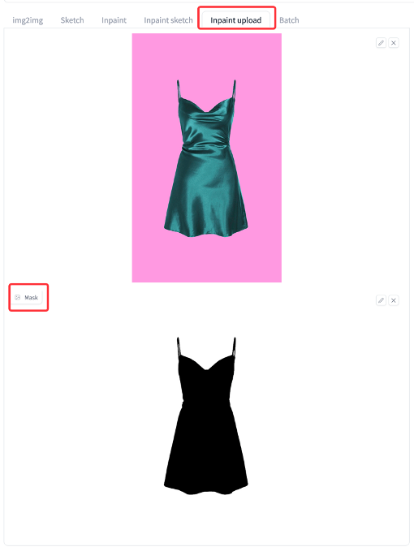

### b、Inpaint upload参数配置

注意把宽、高分别设置到600 * 1000，Batch size推荐 1~3

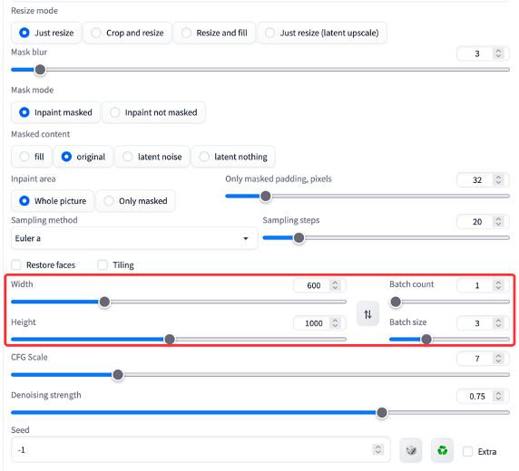

### c、LoRA配置（使用两个参考图片风格的模型）

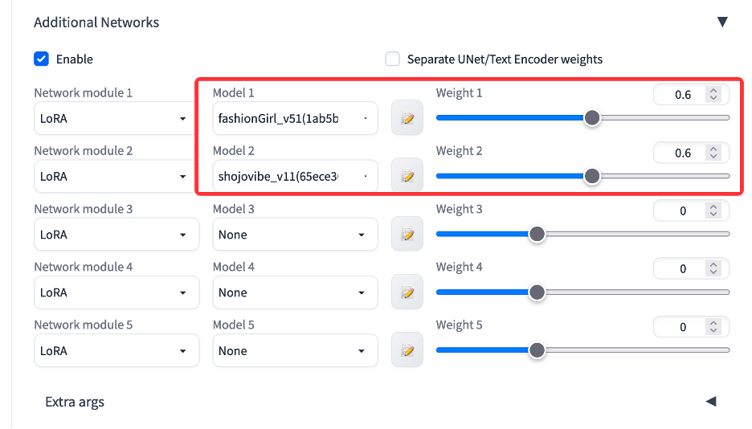

### d、ControlNet配置（需要配置MultiControlNet，参考步骤3）

在 Control Model – 0 tab 页配置服装图片，选择启用Enable和低内存Low VRAM开关，预处理和对应模型选择 canny和control_sd15_canny，画布宽高为 600 * 1000。

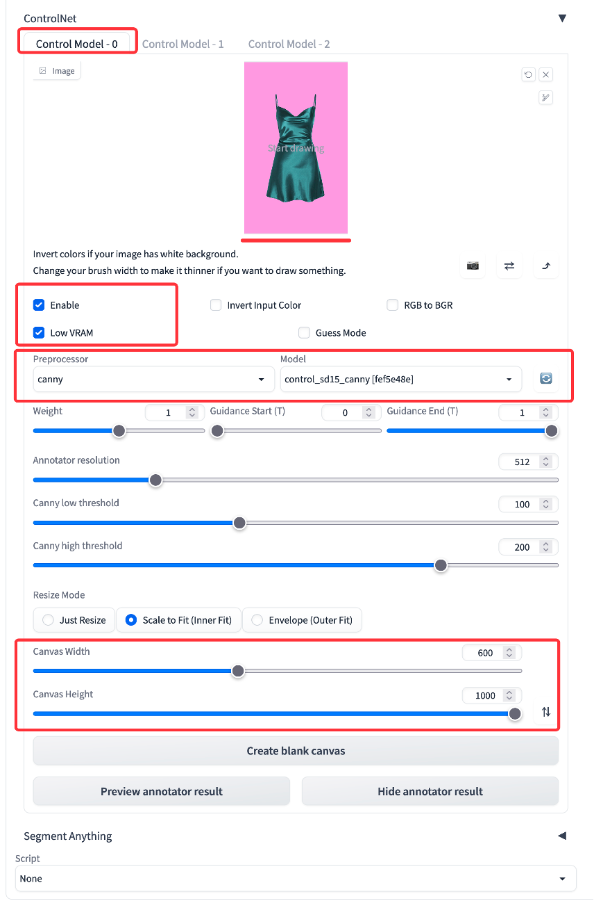

在 Control Model – 1 tab 页配置人体形态图片，选择启用Enable和低内存Low VRAM开关，只需要修改模型选择 control_sd15_canny，画布宽高为 600 * 1000，Guidance End设置为0.6。

## 6、点击生成完成图片生成，第一次会有多个模型加载，速度相对缓慢。

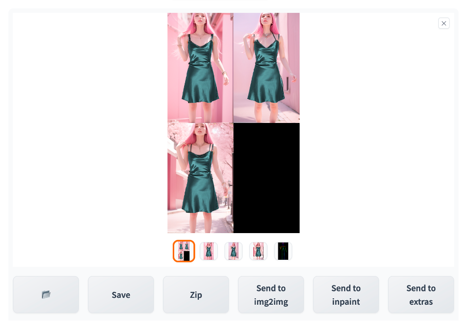

最终效果图片对比：

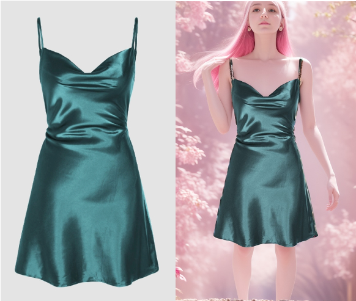