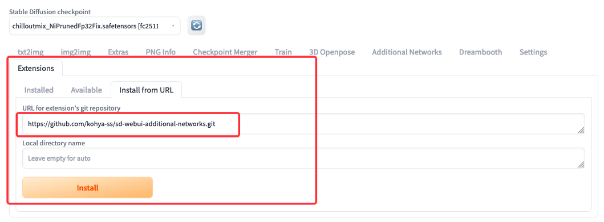
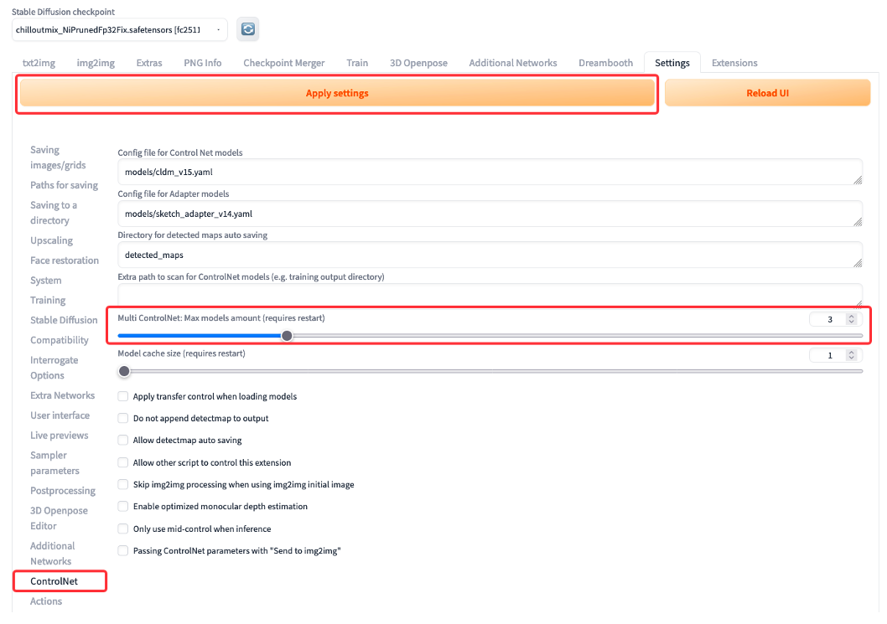

# Stable Diffusion WebUI 在电商场景生成AI模特搭配服装的方案探索

## 概述

Stable diffusion 作为一个开源项目，目前被广泛应用在各个行业和领域做应用探索，本文介绍的方案应用场景是针对电商行业，一些电商公司在日常运营工作中，需要处理大量的模特搭配服装的产品图片，这些图片需要电商公司耗费成本去准备且时间周期也比较长。本方案使用 Stable Diffusion WebUI 及相关的扩展组件应用在 [Amazon EC2](https://aws.amazon.com/cn/ec2/) (本文使用G4dn实例) 探索一种可以快速生成AI模特适配服装产品的方案，供大家参考。当然也可以部署在 [Amazon SageMaker](https://aws.amazon.com/cn/sagemaker/)（通过完全托管的基础设施、工具和工作流程为任何用例构建、训练和部署机器学习 (ML) 模型。）当然不仅如此，利用 [Amazon SageMaker All in one WebUI solution](https://docs.ai.examples.pro/stable-diffusion-webui/) 还能实现利用 WebUI 完成多租户管理，并且实现更弹性、按需使用的并行推理和微调。并且可以进行模型异步推理，不光可以满足企业多用户内部使用，并且可以解决企业客户通过 Stable Diffution 服务海量用户的需求。

以下演示流程使用 WebUI Img2Img 支持服装图片和蒙版、LoRA 提供人物风格模型、ControlNet 控制人体姿态的组合使用。

- Stable diffusion Web UI 是由 AUTOMATIC1111 开发的基于 Stable diffusion AI 模型的 AI 图片处理工具，支持文生图、图生图。 目前 Stable Diffusion 模型微调主要有4种方式：Dreambooth、LoRA (Low-Rank Adaptation of Large Language Models)、Textual Inversion、Hypernetworks。
- LoRA，英文全称 Low-Rank Adaptation of Large Language Models，直译为大语言模型的低阶自适应，它是一种可以将扩散模型带向全新层次的技巧。LoRA最初设计是为了教模型学习新概念，目前为止大多数用来训练角色风格化艺术。
- ControlNet 是一种通过添加额外条件来控制扩散模型的神经网络结构。它提供了一种增强稳定扩散的方法，在文本到图像生成过程中使用条件输入，如涂鸦、边缘映射、分割映射、Pose 关键点等。可以让生成的图像将更接近输入图像，这比传统的图像到图像生成方法有了很大的改进。

注：以下使用的图片来源于网络，配合实验做了对应的图片效果处理。所有的 Prompt 词和参数只是参考样例，可以对参数配置做不断地优化去提升图片输出效果。

## 1、实验环境准备

在亚马逊云科技上可以很方便的使用 GPU 实例构建单机版本的 WebUI 环境做日常的测试使用，推荐使用 G4dn 机型（NVIDIA T4 GPU，16 GiB 显存）或者 G5 机型（NVIDIA A10G GPU，24 GiB 显存）。

### a、搭建 Stable Diffusion WebUI，由于相关版本和扩展更新比较快，直接去 Github 下载最新版本可以获得更多的功能支持能力。


### b、下载 chilloutmix 模型：进入 stable-diffusion-webui/models/Stable-diffusion 文件夹，通过如下命令行下载 chilloutmix 模型到本地。

```
cd stable-diffusion-webui/models/Stable-diffusion
wget -O chilloutmix_NiPrunedFp32.safetensors https://civitai.com/api/download/models/9475
```

### c、LoRA 扩展安装，最新版本的 WebUI 已经内置了 LoRA，只需要单独安装Additional Network 这个扩展即可，在 WebUI 界面的 Extensions 页面，使用 Install from URL 安装。链接：[sd-webui-additional-networks](https://github.com/kohya-ss/sd-webui-additional-networks.git)



#### 风格模型下载：
- FashionGirl：[https://civitai.com/models/8217?modelVersionId=28342](https://civitai.com/models/8217?modelVersionId=28342)
- ShojoVibe：[https://civitai.com/models/13213/shojovibe](https://civitai.com/models/13213/shojovibe)

### d、ControlNet 和 3D Open Pose Edit 扩展安装，可以直接通过 WebUI 的官方扩展搜索。


以上为单 GPU 实例部署方式，若需 Amazon Sagemaker 部署方式请参考Blog:
[生花妙笔信手来 – 基于 SageMaker Notebook 快速搭建托管的 Stable Diffusion – AI 作画可视化环境](https://aws.amazon.com/cn/blogs/china/quickly-build-a-hosted-stable-diffusion-ai-drawing-visualization-environment-based-on-sagemaker-notebook/)

## 2、图片处理

### a、原服装图片（推荐使用与样例图片相仿的素材，通过假人模特去拍摄服装素材图片）


### b、使用图片处理工具处理分别得到一张纯色背景图片和服装部分涂黑的蒙版图片，需要保证两张图片内服装的位置一致，且图片尺寸需要指定 宽 * 高 = 600 * 1000。


## 3、模特姿态线条图处理

使用 WebUI 的 3D Openpose 扩展插件，导入处理好的图片作为背景。

### a、导入图片作为背景图，设置宽度和高度分别为 600 和 1000


### b、调整姿态结构对应服装相对合适穿着位置


### c、点击生成，选取第一种姿态图片下载到本地备用


### 以上步骤完成了三张图片素材的准备工作，得到以下纯色背景服装图、蒙版图、姿态图


## 4、修改 ControlNet 的系统设置，提供3个控制选项Tab页，应用设置（注意：会重启 WebUI，改变 WebUI 访问临时域名）



## 5、选择 chilloutmax 模型（基于sd 1.5 fine-tunning），填写样例 prompt 词。


### 参考的正向词（示例）：

belly button,((thin thighs))),slim body,((on street)),long hair,pink hair,ockings,best quality, amazing, {Scenes with extreme detail {{{extremely deCG}}}),{{beautiful detailed background}}

### 参考的负向词（示例）：

lowres, (bad anatomy), bad hands, mutated hand, text, error, missing fingeewer digits, cropped, worst quality, low quality, normal quality, jpeg artatermark, username, blurry, artist name, out of focus, glowing eyes, ((multiple views))), ((bad proportions))), ((multiple legs))), (((multiple arms)), 3D, bad_prompt, (worst quality:2.0), (lbw quality:2.0), inaccurate limb, lowres, bad anatomy, bad hands, texterror, missing figers, extra digit, fewer digits, cropped, worst quality, low quality, nlity, jpeg artifacts, signature, watermark, username, blurry, artist name,nting by bad-artist-anime:0.9), (painting by bad-artist:0.9), bad-prompt:0.5, watermark, text, error, blurry, jpeg artifacts, cropped, normatifacts, signature, watermark, username, artist name, (worst quality, low natomy, low quality lowres, low quality lowres low polygon 3D game, low quality lowres monochrome sketch rough graffiti, pwres very ugly fat obesity scar, low quality lowres chibi, low quality load anatomy, low quality lowres graffiti unbecoming colorfully, low quality lowres incoherent background, low qualilong body, low quality lowres duplicate comparison, low quality lowres skeurtstyle doujinshi, low quality lowres sketch, low quality lowres text font ui error missing digit blurry, low quality lowres JPEG arazy bleary, low quality lowres monochrome parody meme, low quality lowres tture, low quality lowres disfigured mutated malformed twisted human body, low quality lowres futanari tranny, lobw quality lowres tentacle skeleton, low quality lowres vomit suicide death dirty, (nipples:1.2), lowres, bad anatomy, bad hands, text, error,nissing fingers extra digit, fewer digits, cropped, worst quality, low quality, normal quasignature, watermark, username, blurry, Wrong hands, wrong fingers,fingersed fingers, fingers missed, missed fingers, cheese fingers, chocolate fingers, fingers on fingers, closed fist, fighting fistwith fist, many fists, only hands with wrong fists, fingers crossed, lowres, (bad anatomy), bad hands, mutated hand, text, error, missing fingeewer digits, cropped, worst quality, low quality, normal quality, jpeg artatermark, username, blurry, artist name, out of focus, glowing eyes, ((multiple views))), ((bad proportions))), ((multiple legs))), (((multiple arms)), 3D, bad_prompt, (worst quality:2.0), (lbw quality:2.0), inaccurate limb, lowres, bad anatomy, bad hands, texterror, missing figers, extra digit, fewer digits, cropped, worst quality, low quality, nlity, jpeg artifacts, signature, watermark, username, blurry, artist name,nting by bad-artist-anime:0.9), (painting by bad-artist:0.9), bad-prompt:0.5, watermark, text, error, blurry, jpeg artifacts, cropped, normatifacts, signature, watermark, username, artist name, (worst quality, low natomy, low quality lowres, low quality lowres low polygon 3D game, low quality lowres monochrome sketch rough graffiti, pwres very ugly fat obesity scar, low quality lowres chibi, low quality load anatomy, low quality lowres graffiti unbecoming colorfully, low quality lowres incoherent background, low qualilong body, low quality lowres duplicate comparison, low quality lowres skeurtstyle doujinshi, low quality lowres sketch, low quality lowres text font ui error missing digit blurry, low quality lowres JPEG arazy bleary, low quality lowres monochrome parody meme, low quality lowres tture, low quality lowres disfigured mutated malformed twisted human body, low quality lowres futanari tranny, lobw quality lowres tentacle skeleton, low quality lowres vomit suicide death dirty, (nipples:1.2), lowres, bad anatomy, bad hands, text, error,nissing fingers extra digit, fewer digits, cropped, worst quality, low quality, normal quasignature, watermark, username, blurry, Wrong hands, wrong fingers,fingersed fingers, fingers missed, missed fingers, cheese fingers, chocolate fingers, fingers on fingers, closed fist, fighting fistwith fist, many fists, only hands with wrong fists, fingers crossed, lowres, (bad anatomy), bad hands, mutated hand, text, error, missing fingeewer digits, cropped, worst quality, low quality, normal quality, jpeg artatermark, username, blurry, artist name, out of focus, glowing eyes, ((multiple views))), ((bad proportions))), ((multiple legs))), (((multiple arms)), 3D, bad_prompt, (worst quality:2.0), (lbw quality:2.0), inaccurate limb, lowres, bad anatomy, bad hands, texterror, missing figers, extra digit, fewer digits, cropped, worst quality, low quality, nlity, jpeg artifacts, signature, watermark, username, blurry, artist name,nting by bad-artist-anime:0.9), (painting by bad-artist:0.9), bad-prompt:0.5, watermark, text, error, blurry, jpeg artifacts, cropped, normatifacts, signature, watermark, username, artist name, (worst quality, low natomy, low quality lowres, low quality lowres low polygon 3D game, low quality lowres monochrome sketch rough graffiti, pwres very ugly fat obesity scar, low quality lowres chibi, low quality load anatomy, low quality lowres graffiti unbecoming colorfully, low quality lowres incoherent background, low qualilong body, low quality lowres duplicate comparison, low quality lowres skeurtstyle doujinshi, low quality lowres sketch, low quality lowres text font ui error missing digit blurry, low quality lowres JPEG arazy bleary, low quality lowres monochrome parody meme, low quality lowres tture, low quality lowres disfigured mutated malformed twisted human body, low quality lowres futanari tranny, lobw quality lowres tentacle skeleton, low quality lowres vomit suicide death dirty, (nipples:1.2), lowres, bad anatomy, bad hands, text, error,nissing fingers extra digit, fewer digits, cropped, worst quality, low quality, normal quasignature, watermark, username, blurry, Wrong hands, wrong fingers,fingersed fingers, fingers missed, missed fingers, cheese fingers, chocolate fingers, fingers on fingers, closed fist, fighting fistwith fist, many fists, only hands with wrong fists, fingers crossed, lowres, (bad anatomy), bad hands, mutated hand, text, error, missing fingeewer digits, cropped, worst quality, low quality, normal quality, jpeg artatermark, username, blurry, artist name, out of focus, glowing eyes, ((multiple views))), ((bad proportions))), ((multiple legs))), (((multiple arms)), 3D, bad_prompt, (worst quality:2.0), (lbw quality:2.0), inaccurate limb, lowres, bad anatomy, bad hands, texterror, missing figers, extra digit, fewer digits, cropped, worst quality, low quality, nlity, jpeg artifacts, signature, watermark, username, blurry, artist name,nting by bad-artist-anime:0.9), (painting by bad-artist:0.9), bad-prompt:0.5, watermark, text, error, blurry, jpeg artifacts, cropped, normatifacts, signature, watermark, username, artist name, (worst quality, low natomy, low quality lowres, low quality lowres low polygon 3D game, low quality lowres monochrome sketch rough graffiti, pwres very ugly fat obesity scar, low quality lowres chibi, low quality load anatomy, low quality lowres graffiti unbecoming colorfully, low quality lowres incoherent background, low qualilong body, low quality lowres duplicate comparison, low quality lowres skeurtstyle doujinshi, low quality lowres sketch, low quality lowres text font ui error missing digit blurry, low quality lowres JPEG arazy bleary, low quality lowres monochrome parody meme, low quality lowres tture, low quality lowres disfigured mutated malformed twisted human body, low quality lowres futanari tranny, lobw quality lowres tentacle skeleton, low quality lowres vomit suicide death dirty, (nipples:1.2), lowres, bad anatomy, bad hands, text, error,nissing fingers extra digit, fewer digits, cropped, worst quality, low quality, normal quasignature, watermark, username, blurry, Wrong hands, wrong fingers,fingersed fingers, fingers missed, missed fingers, cheese fingers, chocolate fingers, fingers on fingers, closed fist, fighting fistwith fist, many fists, only hands with wrong fists, fingers crossed

## 6、相关配置（Inpaint upload、LoRA、ControlNet）

### a、图片和蒙版


### b、Inpaint upload 参数配置

注意把宽、高分别设置到600 * 1000，Batch size推荐 1~3


### c、LoRA 配置（使用两个参考图片风格的模型）


### d、ControlNet 配置（需要配置MultiControlNet，参考步骤3）

在 Control Model – 0 tab 页配置服装图片，选择启用 Enable 和低内存 Low VRAM 开关，预处理和对应模型选择 canny 和 control_sd15_canny，画布宽高为 600 * 1000。


在 Control Model – 1 tab 页配置人体形态图片，选择启用 Enable 和低内存 Low VRAM 开关，只需要修改模型选择 control_sd15_canny，画布宽高为 600 * 1000，Guidance End 设置为0.6。


## 7、点击生成完成图片生成，第一次会有多个模型加载，速度相对缓慢。


最终效果图片对比：


## 8、总结

利用 Stable Diffusion WebUI + LoRA + ControlNet 做 AI 模特适配电商服装图片生成的方案，可以在一些电商运营场景下降低服装商品图片素材的生产成本和周期。在整个方案的流程中，图片处理还可以考虑去探索借助 Sagment Anything 去分隔服装和生成对应的蒙版。